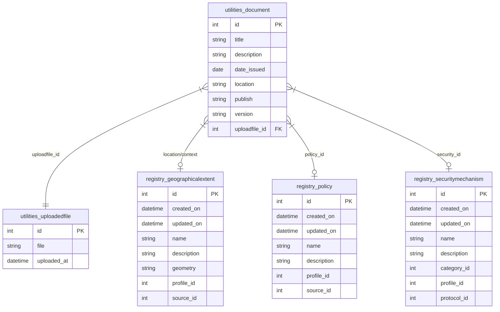

# Plano de Arquitetura e Implementação - ServiceRegistroSWIMBR

Este documento descreve a arquitetura proposta e o plano passo a passo para a construção do backend **ServiceRegistroSWIMBR** (FastAPI) para se integrar ao frontend existente **AppRegistroSWIMBR**.

## O Objetivo
Desenvolver do zero uma API REST robusta, segura e escalável, garantindo total conformidade aos contratos de dados esperados pelo frontend de CRM existente.

---

## 1. Levantamento de Requisitos e Entidades

Através da verificação do repositório frontend (`src/models/*`), as seguintes entidades principais foram identificadas para sustentar o CRM:

- **Users**: Contém `id`, `name`, `username`, `email`, `firstName`, `lastName`, `phoneNumber`, `userType`, `isMilitary`, `userLevelAuth`, `isActive`, `isStaff`, `isSuperuser`, `avatar`, e o vínculo opcional com a organização (`organization`).
- **Organizations**: Para representar clientes/agências institucionais. (Contém `id`, `name` no mínimo).
- **Documents** (Prioridade): Possui `id`, `title`, `publish` (Publicador), `dateIssued`, `version`, `description`, `location`, `uploadfile`.
- **Registry / Services**: Há uma vasta gama de modelos refletindo Serviços SWIM, Operações, Consumidores, Provedores, Restrições Ambientais (`environmental-constraint`), Políticas, etc.

O backend precisará retornar os dados em um padrão consistente. O frontend parece esperar respostas englobadas ou listas diretas dependendo da rota (exemplo em GET `/documents`: os dados devem preferencialmente ser uma lista ou envolver um JSON padronizado com `{ data: [...] }`).

---

## 2. Arquitetura do Backend

O padrão arquitetural recomendado é a **Layered Architecture (Arquitetura em Camadas)**, fortemente inspirada no "Clean Code" e "Domain-Driven Design (DDD) simplificado". No ecossistema FastAPI, dividiremos a aplicação nas seguintes camadas:

```text
ServiceRegistroSWIMBR/
├── api/                   # (Routers) Controladores, definição das rotas / endpoints REST
│   ├── v1/                # Versionamento (endpoints organizados por domínio)
│   │   ├── endpoints/
│   │   │   ├── users.py
│   │   │   ├── documents.py
│   │   │   └── ...
│   └── dependencies.py    # Dependências injetáveis do FastAPI (ex: get_db, auth)
├── core/                  # (Core) Configurações centrais, variáveis de ambiente, JWT e Security
├── db/                    # (Database) Instanciação do SQLAlchemy, Base declarativa
├── models/                # (Models/Entities) Modelos ORM, tabelas puras no banco (SQLAlchemy)
├── schemas/               # (Schemas/DTOs) Modelos de I/O do Pydantic (validação)
├── crud/                  # (Repository) Acesso a dados base e centralizado (Operações no BD)
├── services/              # (Business Logic) Regras de negócio complexas que chamam CRUDS ou APIs externas
├── tests/                 # Testes automatizados (Pytest)
├── alembic/               # Arquivos de migração do banco
└── main.py                # Entrypoint, setup de middlewares, routers, e CORS
```

**Justificativa:** 
Permite a "Separation of Concerns" (Separação de responsabilidades). O roteador (API) não conhece as queries de banco (Model), apenas consome o serviço (Service) ou o repositório (CRUD). Os Data Transfer Objects (Schemas) isolam a API de expor modelos internos por engano.

---

## 3. Modelagem do Banco de Dados (PostgreSQL)

O banco de dados relacional deve garantir a normalização. As chaves primárias são inteiros auto-incrementais ou UUIDs conforme a convenção de cada módulo.

### 3.1. Diagrama Entidade-Relacionamento (ERD)



### 3.2. Detalhamento das Tabelas:

**Table `utilities_document`** (Prioridade ABSOLUTA)
- `id` (PK, Integer)
- `title` (String)
- `description` (Text)
- `date_issued` (Date)
- `location` (String/Relation)
- `publish` (String/Boolean)
- `version` (String)
- `uploadfile_id` (FK -> `utilities_uploadedfile.id`)

**Table `utilities_uploadedfile`**
- `id` (PK, Integer)
- `file` (String)
- `uploaded_at` (DateTime)

**Table `registry_geographicalextent`**
- `id` (PK, Integer)
- `name` (String)
- `description` (Text)
- `geometry` (Geometry/String)
- `profile_id`, `source_id` (Integer)
- `created_on`, `updated_on` (DateTime)

**Table `registry_policy`**
- `id` (PK, Integer)
- `name` (String)
- `description` (Text)
- `profile_id`, `source_id` (Integer)
- `created_on`, `updated_on` (DateTime)

**Table `registry_securitymechanism`**
- `id` (PK, Integer)
- `name` (String)
- `description` (Text)
- `category_id`, `profile_id`, `protocol_id` (Integer)
- `created_on`, `updated_on` (DateTime)

**Table `users`** (Auth & Autoria)
- `id` (PK, Integer)
- `organization_id` (FK -> `organizations.id`)
- `username`, `email` (String, Unique)
- `hashed_password` (String)
- `first_name`, `last_name`, `phone_number` (String)
- `user_type`, `user_level_auth` (Enum/String)
- `is_active`, `is_staff`, `is_superuser`, `is_military` (Boolean)
- `created_at`, `updated_at` (DateTime)

**Table `organizations`**
- `id` (PK, Integer)
- `name` (String, Unique)

---

## 4. Tecnologias e Padrões Definidos

- **Framework Core**: FastAPI (Python 3.10+)
- **Documentação de API (Swagger/OpenAPI)**: Geração nativa e automática do `/docs` (Swagger UI) e `/redoc`. Será enriquecida com metadados (tags, summary, responses) nas rotas e `Field` no Pydantic para dar previsibilidade total à equipe de Frontend.
- **ORM**: SQLAlchemy 2.0 (Estilo Declarativo 2.0). Pode-se usar estilo "async" para suportar alto tráfego sem bloqueios IO.
- **Migrações**: Alembic (gera automaticamente a evolução de schema no banco de dados).
- **Validação de Dados**: Pydantic V2 (Para Request/Response schemas).
- **Autenticação**: OAuth2 via JWT (JSON Web Tokens) através da classe `OAuth2PasswordBearer` integrada nativamente ao Swagger do FastAPI.
- **Uploads de Arquivos**: O FastAPI disponibiliza nativamente o `UploadFile` que é lido em memória/disco via `StreamingResponse` de forma eficiente.
- **Segurança de Senhas**: Passlib com hash e salting em **bcrypt**.

---

## 5. Plano de Implementação por Fases

A implementação ocorrerá nas seguintes iterações (ágil):

### Fase 1 — Setup e Infraestrutura
- Escrita do arquivo `requirements.txt` (FastAPI, uvicorn, sqlalchemy, psycopg2, pydantic, alembic, python-dotenv).
- Configuração do `core/config.py` (Classe de settings do pydantic carregando o `.env`).
- Inicialização do Banco local via `docker-compose.yml` e conexão do SQLAlchemy (`db/session.py`).
- Inicialização da camada de Models (criação das classes Base do ORM).
- Geração da "Initial Migration" com Alembic.

### Fase 2 — Autenticação e Autorização Básica e Usuários (Requisito para Autoria de Documentos)
- Criação do Model `Users` e `Organizations`.
- Criação dos Schemas `UserCreate`, `UserRead`, `Token`.
- Configuração do JWT Middleware em `core/security.py`.
- Rota POST `/auth/login` retornando token JWT.
- Criação de regra CRUD e API simples e a injeção `get_current_active_user`.

### Fase 3 — Módulo de Documentos (Prioridade ABSOLUTA)
- Criação do Model `Document`.
- Criação do Schema `DocumentCreate`, `DocumentRead`, `DocumentUpdate`.
- **Roteamento `api/v1/endpoints/documents.py`:**
  - `POST /documents`: Recepção Híbrida (`MultiPart/Form-Data` para conciliar arquivo binário e campos textuais como `title`, `description`).
  - `GET /documents`: Paginação simplificada (skip/limit retornando lista de documentos com meta informações).
  - `GET /documents/{id}`: Ler arquivo ou binário ou metadados.
  - `PUT /documents/{id}`: Atualização de informações / versão do documento.
  - `DELETE /documents/{id}`: Exclusão (Soft Delete vs Hard Delete, dependendo do design).

### Fase 4 — Integração e Ajuste de Contratos
- Validar se o Frontend faz GET de fato em `/documents` ou se usa uma sub-rota (Ex: `/api/v1/documents`).
- Configurar **CORS** para a origem do frontend `http://localhost:5173` ou equivalente Vite/NextJS.
- Tratamento Global de Exceções (`HTTPException`) com retornos `{ "detail": "Erro..." }` para casamento da UI (onde Snackbar escuta formato da exceção no React).

### Fase 5 — Escalabilidade e Performance
- Criação de Índices no Postgres (já definidos parcialmente na modelagem declarativa).
- Implementação de Filtros/Buscas: Ex: `GET /documents?title=xyz&publish=abc`.

---

## 6. Boas Práticas Adotadas

1. **Repository Pattern (`crud` dir)**: Isolamento do BD. Caso haja uma troca para MongoDB no futuro (improvável, mas conceitualmente correto), altera-se os `crud/*` sem tocar nos `routers`.
2. **SOLID**: Nomes claros, funções pequenas (`clean code`), Injeção de dependência via FastAPI `Depends()`.
3. **Tipagem Forte**: Uso intensivo de Type Hints (`-> list[DocumentRead]`) para ganho do autocomplete IDE e auto-validação do FastAPI para a doc Swagger generativa.

---

## 7. Segurança de Ponta a Ponta

- **SQL Injection**: Anulada devido ao uso da biblioteca SQLAlchemy (Parametrização).
- **XSS (Cross-Site Scripting)**: O Backend retorna JSON limpo, e valida string escapes com Pydantic. É competência do Frontend (React) não usar `dangerouslySetInnerHTML`.
- **RBAC (Role Based Access Control)**: O campo `is_superuser`/`is_staff` em user controlará a rota via Injeção de Dependências.
- **Validação Rigorosa**: Qualquer JSON fora do Shape do Pydantic lança `422 Unprocessable Entity` sem comprometer o sistema de banco.

---

## 8. Testes (QA Engineer Perspective)

A verificação do funcionamento usará o `pytest` aliado ao `TestClient` (from `fastapi.testclient`).
A estrutura em `tests/` abrigará:
- `conftest.py` (Fixtures globais, Db mockado no sqlite de memória se necessário ou um container db efêmero).
- `tests/api/v1/test_documents.py` (Testando endpoints REST retornam 200, 201, 401, etc).
- `tests/crud/test_documents.py` (Testando integridade da persistência no DB).

---

## 9. Lista de Entregáveis por Fase (Checklist)

Para referenciar os entregáveis que o desenvolvimento gerará:

1. A pasta projeto `ServiceRegistroSWIMBR` pronta e configurada.
2. Arquivos `.env` modelo.
3. Repositório SQLAlchemy rodando limpo (Alembic `alembic init alembic`).
4. Pastas de domínios `users`, `organizations`, `documents`.
5. Os arquivos em `/db` configurados.
6. A interface `Swagger / Redoc` (nativo do FastAPI) online demonstrando todas as rotas ativas em `/docs`, acompanhada do esquema completo (OpenAPI.json) para que o Front-End possa gerar tipagens Typescript automaticamente (se desejar).

---

## Conclusão
A adoção desta Service Layer somada aos CRUDS da Pydantic permite reuso rápido e fácil manutenção para módulos futuros (como Módulo de Registros SOAP/REST que já existe no frontend em models `registry`). Cada módulo no frontend se refletirá de maneira limpa como um namespace lógico no Roteador e no Modelo do Database do Backend.
